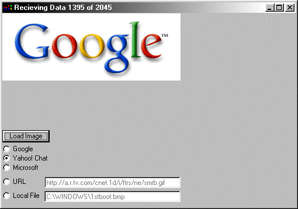



## NetImage

### Description

UserControl for downloading images off of the internet. It works as though it is a mini web browser, looking for http:// or file:// prefix. It doesn't support FTP yet but it will soon and it is contained in an example Project. Please vote for me
 
### More Info
 

             |
---                |---
**Submitted On**   |2001-09-23 18:45:00
**By**             |[DoWnLoHo](https://github.com/Planet-Source-Code/PSCIndex/blob/master/ByAuthor/downloho.md)
**Level**          |Intermediate
**User Rating**    |5.0 (25 globes from 5 users)
**Compatibility**  |VB 6\.0
**Category**       |[Internet/ HTML](https://github.com/Planet-Source-Code/PSCIndex/blob/master/ByCategory/internet-html__1-34.md)
**World**          |[Visual Basic](https://github.com/Planet-Source-Code/PSCIndex/blob/master/ByWorld/visual-basic.md)
**Archive File**   |[NetImage268679232001\.zip](https://github.com/Planet-Source-Code/downloho-netimage__1-27492/archive/master.zip)

